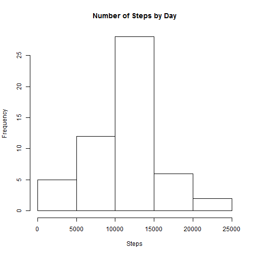
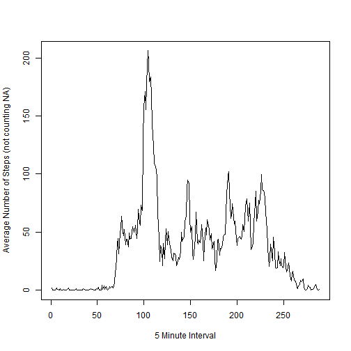
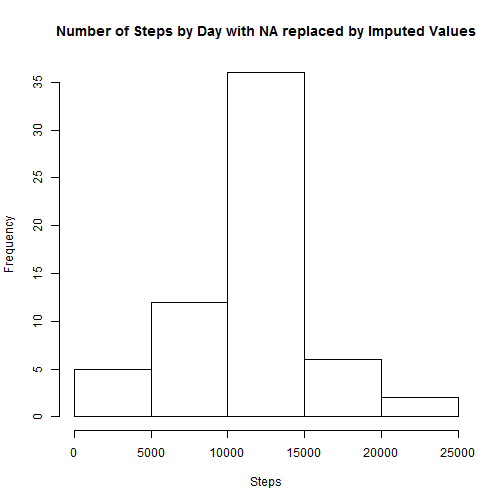
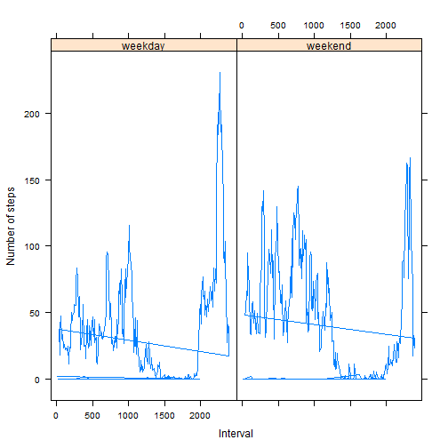

# Reproducible Research: Peer Assessment 1


## Loading and preprocessing the data

```r
setwd("./activity")
activity <- read.csv("activity.csv")
dailySteps <- tapply(activity$steps, activity$date, sum)
hist(dailySteps, main = "Number of Steps by Day", xlab = "Steps")
```

 


## What is mean total number of steps taken per day?

```r
meanSteps <- mean(dailySteps, na.rm = TRUE)
meanSteps  # 10766.19
```

```
## [1] 10766
```

```r
medianSteps <- median(dailySteps, na.rm = TRUE)
medianSteps  #  10765
```

```
## [1] 10765
```


## What is the average daily activity pattern?

```r
adap = tapply(activity$steps, activity$interval, mean, na.rm = TRUE)
adap  # Raw Data
```

```
##         0         5        10        15        20        25        30 
##   1.71698   0.33962   0.13208   0.15094   0.07547   2.09434   0.52830 
##        35        40        45        50        55       100       105 
##   0.86792   0.00000   1.47170   0.30189   0.13208   0.32075   0.67925 
##       110       115       120       125       130       135       140 
##   0.15094   0.33962   0.00000   1.11321   1.83019   0.16981   0.16981 
##       145       150       155       200       205       210       215 
##   0.37736   0.26415   0.00000   0.00000   0.00000   1.13208   0.00000 
##       220       225       230       235       240       245       250 
##   0.00000   0.13208   0.00000   0.22642   0.00000   0.00000   1.54717 
##       255       300       305       310       315       320       325 
##   0.94340   0.00000   0.00000   0.00000   0.00000   0.20755   0.62264 
##       330       335       340       345       350       355       400 
##   1.62264   0.58491   0.49057   0.07547   0.00000   0.00000   1.18868 
##       405       410       415       420       425       430       435 
##   0.94340   2.56604   0.00000   0.33962   0.35849   4.11321   0.66038 
##       440       445       450       455       500       505       510 
##   3.49057   0.83019   3.11321   1.11321   0.00000   1.56604   3.00000 
##       515       520       525       530       535       540       545 
##   2.24528   3.32075   2.96226   2.09434   6.05660  16.01887  18.33962 
##       550       555       600       605       610       615       620 
##  39.45283  44.49057  31.49057  49.26415  53.77358  63.45283  49.96226 
##       625       630       635       640       645       650       655 
##  47.07547  52.15094  39.33962  44.01887  44.16981  37.35849  49.03774 
##       700       705       710       715       720       725       730 
##  43.81132  44.37736  50.50943  54.50943  49.92453  50.98113  55.67925 
##       735       740       745       750       755       800       805 
##  44.32075  52.26415  69.54717  57.84906  56.15094  73.37736  68.20755 
##       810       815       820       825       830       835       840 
## 129.43396 157.52830 171.15094 155.39623 177.30189 206.16981 195.92453 
##       845       850       855       900       905       910       915 
## 179.56604 183.39623 167.01887 143.45283 124.03774 109.11321 108.11321 
##       920       925       930       935       940       945       950 
## 103.71698  95.96226  66.20755  45.22642  24.79245  38.75472  34.98113 
##       955      1000      1005      1010      1015      1020      1025 
##  21.05660  40.56604  26.98113  42.41509  52.66038  38.92453  50.79245 
##      1030      1035      1040      1045      1050      1055      1100 
##  44.28302  37.41509  34.69811  28.33962  25.09434  31.94340  31.35849 
##      1105      1110      1115      1120      1125      1130      1135 
##  29.67925  21.32075  25.54717  28.37736  26.47170  33.43396  49.98113 
##      1140      1145      1150      1155      1200      1205      1210 
##  42.03774  44.60377  46.03774  59.18868  63.86792  87.69811  94.84906 
##      1215      1220      1225      1230      1235      1240      1245 
##  92.77358  63.39623  50.16981  54.47170  32.41509  26.52830  37.73585 
##      1250      1255      1300      1305      1310      1315      1320 
##  45.05660  67.28302  42.33962  39.88679  43.26415  40.98113  46.24528 
##      1325      1330      1335      1340      1345      1350      1355 
##  56.43396  42.75472  25.13208  39.96226  53.54717  47.32075  60.81132 
##      1400      1405      1410      1415      1420      1425      1430 
##  55.75472  51.96226  43.58491  48.69811  35.47170  37.54717  41.84906 
##      1435      1440      1445      1450      1455      1500      1505 
##  27.50943  17.11321  26.07547  43.62264  43.77358  30.01887  36.07547 
##      1510      1515      1520      1525      1530      1535      1540 
##  35.49057  38.84906  45.96226  47.75472  48.13208  65.32075  82.90566 
##      1545      1550      1555      1600      1605      1610      1615 
##  98.66038 102.11321  83.96226  62.13208  64.13208  74.54717  63.16981 
##      1620      1625      1630      1635      1640      1645      1650 
##  56.90566  59.77358  43.86792  38.56604  44.66038  45.45283  46.20755 
##      1655      1700      1705      1710      1715      1720      1725 
##  43.67925  46.62264  56.30189  50.71698  61.22642  72.71698  78.94340 
##      1730      1735      1740      1745      1750      1755      1800 
##  68.94340  59.66038  75.09434  56.50943  34.77358  37.45283  40.67925 
##      1805      1810      1815      1820      1825      1830      1835 
##  58.01887  74.69811  85.32075  59.26415  67.77358  77.69811  74.24528 
##      1840      1845      1850      1855      1900      1905      1910 
##  85.33962  99.45283  86.58491  85.60377  84.86792  77.83019  58.03774 
##      1915      1920      1925      1930      1935      1940      1945 
##  53.35849  36.32075  20.71698  27.39623  40.01887  30.20755  25.54717 
##      1950      1955      2000      2005      2010      2015      2020 
##  45.66038  33.52830  19.62264  19.01887  19.33962  33.33962  26.81132 
##      2025      2030      2035      2040      2045      2050      2055 
##  21.16981  27.30189  21.33962  19.54717  21.32075  32.30189  20.15094 
##      2100      2105      2110      2115      2120      2125      2130 
##  15.94340  17.22642  23.45283  19.24528  12.45283   8.01887  14.66038 
##      2135      2140      2145      2150      2155      2200      2205 
##  16.30189   8.67925   7.79245   8.13208   2.62264   1.45283   3.67925 
##      2210      2215      2220      2225      2230      2235      2240 
##   4.81132   8.50943   7.07547   8.69811   9.75472   2.20755   0.32075 
##      2245      2250      2255      2300      2305      2310      2315 
##   0.11321   1.60377   4.60377   3.30189   2.84906   0.00000   0.83019 
##      2320      2325      2330      2335      2340      2345      2350 
##   0.96226   1.58491   2.60377   4.69811   3.30189   0.64151   0.22642 
##      2355 
##   1.07547
```

```r
plot(adap, type = "l", xlab = "5 Minute Interval", ylab = "Average Number of Steps (not counting NA)")  # Line Plot
```

 

```r

g <- data.frame(adap, names(adap))
names(g) <- c("activity", "interval")
as.numeric(as.character(g[g$activity == max(g$activity), 2][1]))  # Interval 835 has the maximum average number of steps 206.1698
```

```
## [1] 835
```


## Imputing missing values

```r
activityNA = is.na(activity$steps)
sum(activityNA)  # 1. 2304 missing values
```

```
## [1] 2304
```

```r
# 2. replace the NA with the mean of non NA values for that 5 minute period
activityImputed = activity
adapInterval = as.numeric(names(adap))
adapImputedSteps = as.numeric(adap)
imp_table = data.frame(adapInterval, adapImputedSteps)
for (i in 1:nrow(activity)) {
    # 3. Create a new dataset with imputed values
    if (activityNA[i]) {
        activityImputed$steps[i] = imp_table[imp_table$adapInterval == activityImputed$interval[i], 
            2]
    }
}
activityImputedDaily <- tapply(activityImputed$steps, activityImputed$date, 
    sum)
hist(activityImputedDaily, main = "Number of Steps by Day with NA replaced by Imputed Values", 
    xlab = "Steps")  #4. 
```

 

```r
mean(activityImputedDaily)  #4. Mean steps per day:   10766.19
```

```
## [1] 10766
```

```r
median(activityImputedDaily)  #4. Median steps per day: 10766.19
```

```
## [1] 10766
```


## Are there differences in activity patterns between weekdays and weekends?

```r
newdate <- strptime(activityImputed$date, "%m/%d/%Y")
wdays <- weekdays(newdate)
wend <- ifelse(wdays == "Saturday" | wdays == "Sunday", 1, 0)
activityImputed <- data.frame(activityImputed, wdays, wend)

actImp <- with(activityImputed, tapply(steps, list(interval, wend), mean))
steps <- c(actImp[, 1], actImp[, 2])
intervals <- names(adap)
df <- data.frame(rep(intervals, 2), steps, rep(c("weekday", "weekend"), each = 288))  #1. Create a new factor variable in the dataset with two levels 'weekday' and 'weekend'
names(df) <- c("intervals", "steps", "days")

# 2. Make a panel plot containing a time series plot (i.e. type = 'l') of
# the 5-minute interval (x-axis) and the average number of steps taken,
# averaged across all weekday days or weekend days (y-axis).
library(lattice)
xyplot(steps ~ intervals | days, data = df, t = "l", xlim = c(-10, 300), ylab = "Number of steps", 
    xlab = "Interval", scales = list(x = list(at = c(0, 60, 120, 180, 240), 
        labels = c(0, 500, 1000, 1500, 2000))))
```

 

